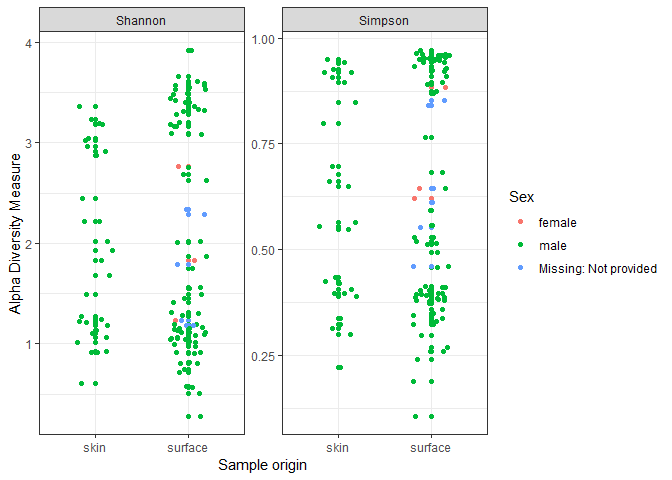
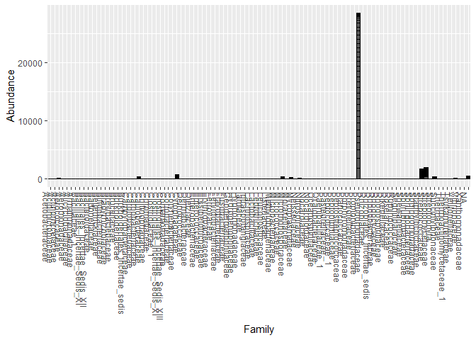

Analysis Report 1: Exploratory data analysis of Fierer dataset
================
Karan Lala
November 12, 2018

Introduction
============

Bacteria are ubiquitous, and human bodies are no exception. We house millions and billions of bacteria, and have them on the surface of our skin too. (Turnbaugh *et al.*, 2007)Skin and gut microbiome analysis and the use of relevant data has sharply increased, and entire companies are using these techniques to find solutions for ailments such as dermatological diseases.(Venturelli *et al.*, 2018) While there are many implicated causes for acne, anaerobic bacterial species *Propionibacterium acnes* is considered the main culprit in the development of acne. Infection with the parasitic mite *Demodex* is associated with the development of acne as well. Informed approaches are being developed to tackle issues such as acne by using microbiome data. By sampling individual's microbiome that do not have acne, and people that do have acne, may reveal a clear distinguishing factor so much more. Furthermore, that implies that changing the makeup of the microbiome to a more beneficial community can drive out acne, and similar approaches used to tackle other dermatological issues. The skin microbiota of a healthy adult may remain stable over time, despite the daily rustle and bustle of life, and so skin microbial communities, if sufficiently unique and identifiable, can be used a forensic technique.(Grice *et al.*, 2009)

The microbiome is being studied extensively, and one such paper, Fierer et al, examines whether the microbiota can be used to uniquely(Grice *et al.*, 2008) identify individuals using samples from the surfaces they've touched. In this study, computer keys and mice have been used as the aforementioned surfaces. The microbial communities are examined, and their similarity to the sample source (fingertip) is evaluated and contrasted with the similarity to other fingertips. The Fierer paper recovers bacterial DNA from surfaces and examines whether it enables sufficient characterization of bacterial communities.The diversity of skin-associated bacterial communities was surprisingly high; a typical hand surface harbored &gt;150 unique species-level bacterial phylotypes(Fierer *et al.*, 2010) For use in forensics, bacterial communities transferred from a person's skin to surface must persist for days to weeks on the surface, which is also examined. Pyrosequencing, an NGS ( Next generation sequencing ) method is used to sequence the 16S part of the organisms since it is highly conserved. Work on the microbiome of multiple home surfaces has shown that the microbial signature of a family can be highly predictive of the microbiome of that family’s home and that individuals within a home can be differentiated. Recent work has shown that postmortem, the microbiome of animal hosts changes dramatically, but in a predictable manner.

Microbial interaction between human-associated objects and the environments inhabited may have forensic implications, and the extent to which microbes are shared between individuals inhabiting the same space may be relevant to human health and disease transmission. For certain persons, babies and immunocompromised individuals for example, human interaction could serverly affect them by transfer of microbial communities. In this exploratory data analysis, the metadata and data from the fingertip and keyboard samples are used with phyloseq, DADA2, ggplot2 and dplyr. The metadata has a lot of information, most which is standard and does not differ across samples. The difference in certain categories, coupled with the data on the microbial community is used to illustrate data and draw conclusions from it. While the phyloseq data can be used witht he phyloseq object, it can be melted for use with ggplot2.

Methods
=======

Bacterial communities found on individuals fingers were compared with the communities obtained from keys on 3 different keyboards, and keys from a few other keyboards to see how well they matched the fingertip samples in question. Individual keys and the fingertip of the owner were swabbed, and these swabs were stored at -80'C before extracting DNA. Amplicon DNA concentrations were measured using the Quant-iT PicoGreen dsDNA reagent and kit.The entire exposed surface of each keyboard key was swabbed lightly for 10 s. All swabs were stored at −80 °C for less than 1 week before DNA extraction.(Cole *et al.*, 2008)

Sample origin and sequencing
============================

Samples came from computer keys and fingertips.Swabbing of samples was performed using autoclaved cotton-tipped swabs pre-moistened with a sterile solution. DNA collected using “MO BIO PowerSoil” DNA Isolation kit, 16S rRNA genes camplified by PCR. PyroSequencing was then carried out by 454 Life Sciences Genome Sequencer FLX instrument and sequences with less than 200 or more than 300 base pairs, contained ambiguous characters, contained an uncorrectable barcode, or did not contain the primer sequence were removed from the analysis. Samples were obtained from three computers, and a number of public and private keyboards for more data.

Computational
-------------

DADA2 starts with set of Illumina-sequenced paired-end fastq files that have been split, sample wise and from which the barcodes/adapters have already been removed.(Callahan *et al.*, 2016) The final product is an amplicon sequence variant (ASV) table, a higher-resolution analogue of the traditional OTU table, which records the number of times each exact amplicon sequence variant was observed in each sample. Taxonomy is then assigned and data can be imported into the popular phyloseq R package for the analysis of microbiome data. Quality profiles for forward and reverse reads are genereated and DADA2 incorporates quality information into its models, for example accounting to Some extent for the low base quality reads at the end of sequences. It then filters and trims the data. DADA2 builds an error model from the data, and starts with an initial guess, as do machine learning techniques. Dereplication combines all identical sequencing reads into into “unique sequences” with a corresponding “abundance” equal to the number of reads with that unique sequence. Dereplication substantially reduces computation time by eliminating redundant comparisons. Now, DADA2 merges the forward and reverse reads together to obtain the full denoised sequences and constructs a sequence variant table by traditional methods. Next, it removes chimeras and provides a native implementation of the naive Bayesian classifier method for assigning taxonomy. Finally, this data generated can be used with phyloseq. The phyloseq package is a tool to import, store, analyze, and graphically display complex phylogenetic sequencing data that has already been clustered into Operational Taxonomic Units (OTUs), especially when there is associated sample data, phylogenetic tree, and/or taxonomic assignment of the OTUs.(McMurdie and Holmes, 2013) This package leverages many of the tools available in R for ecology and phylogenetic analysis (vegan, ade4, ape, picante), while also using advanced/flexible graphic systems (ggplot2) to easily produce publication-quality graphics of complex phylogenetic data.

Results
=======

We can see from the quality profiles that most reads tend to get pretty bad in quality after around 200 bases.

The output table has 115 rows (samples) and 1539 columns (sequence variants). Notice how we can embed R code directly in our markdown text.

After removing chimeras, we were left with 99.97% of our cleaned reads.

``` r
# alpha diversity metrics
plot_richness(phyloseq_obj,
              x = "sample_type",
              measures = c("Shannon", "Simpson"),
              color = "Sex") +
  xlab("Sample origin") +
  geom_jitter(width = 0.2) +
  theme_bw()
```

    ## Warning in estimate_richness(physeq, split = TRUE, measures = measures): The data you have provided does not have
    ## any singletons. This is highly suspicious. Results of richness
    ## estimates (for example) are probably unreliable, or wrong, if you have already
    ## trimmed low-abundance taxa from the data.
    ## 
    ## We recommended that you find the un-trimmed data and retry.



**Figure 1**: Alpha diversity measures of the two sample types, colored by gender. While the data is well represented, it does not provide any obvious conclusions.

``` r
# phylogeny, yay!
plot_tree(phyloseq_obj,
          color = "Sex",
          ladderize = TRUE) # this arranges the tree branches from short to long
```


**Figure 2**: Inferred phylogeny of sequences, with points on tips representing samples within which each particular taxa occurred. Tree represents phylogeny inferred using FastTree.

``` r
#The metadata_in dataset is piped to ggplot and visualized with x and y labels
#below in a point graph as indicated by geom_point
metadata_in %>%
  ggplot(aes(x = host_subject_id, y = sample_source)) +
    geom_point()
```


**Figure 3** : Examination of sample sources and host subjects shows that most of the samples obtained came from individuals M2,M3 and M9. The spacebar key was swabbed for every individual, and M2,M3,M9 are the target of the study and have a lot more samples.

``` r
#A simple bar plot made using the phyloseq object
#with abundance on the y axis, and the order on the x axis

plot_bar(phyloseq_obj,
         x = "Order")
```


**Figure 4** : The abundance of sequence across hosts is visualized, colored for Order. Shows increased presence of Order *Actinomycetales*.

``` r
# A simple bar plot made using the phyloseq object with
#abundance on the y axis, and the Family on the x axis.
plot_bar(phyloseq_obj,
         x = "Family")
```


**Figure 5** : This data shows the distribution of abundance of bacteria by Family, with highest abundance seen in *Propionibacteriaceae*. This is a closer look at the data seen earlier as Family is more specific than Order.

``` r
# From the whole dataset i.e. phyloseq_obj, a subset, only for host M9 is
#stored in a new object and that is used for data visualization.
m9_phyloseq_object <- subset_samples(phyloseq_obj,
                                     host_subject_id == "M9")
plot_bar(m9_phyloseq_object,
         x = "Family")
```



**Figure 6** : This data shows the distribution of abundance of bacteria by Family for one individual, "M9", with highest abundance seen in *Propionibacteriaceae*.

``` r
# From the whole dataset i.e. phyloseq_obj, a subset, only for host
#L1 is stored in a new object and that is used for data visualization.
l1_phyloseq_object <- subset_samples(phyloseq_obj,
                                     host_subject_id == "L1")
plot_bar(l1_phyloseq_object,
         x = "Family")
```


**Figure 7** : This data shows the distribution of abundance of bacteria by Family for one individual, "L1", with highest abundance seen in *Propionibacteriaceae*.

``` r
# A plot network is created with the label and color both for host_subject_id
#and shapes for sample type.
plot_net(phyloseq_obj, maxdist = 0.4, point_label = "host_subject_id",
         color = "host_subject_id", shape = "sample_type")
```


**Figure 8** : Microbiome network representation across samples, and surface type.

``` r
# Creates an alpha diversity plot as seen before,
#but is visualized to see differences between hosts.
#xlab labels the x axis while the rest are styling. This uses the
#Shannon and Simpson method of
#measuring alpha diversity.
plot_richness(phyloseq_obj,
              x = "host_subject_id",
              measures = c("Shannon", "Simpson"),
              color = "sample_type") +
  xlab("Sample origin") +
  geom_jitter(width = 0.2) +
  theme_bw()
```

    ## Warning in estimate_richness(physeq, split = TRUE, measures = measures): The data you have provided does not have
    ## any singletons. This is highly suspicious. Results of richness
    ## estimates (for example) are probably unreliable, or wrong, if you have already
    ## trimmed low-abundance taxa from the data.
    ## 
    ## We recommended that you find the un-trimmed data and retry.


**Figure 9** : Alpha diversity measures according to sample origin are visualized and seems to correlate with figure preceding this.

``` r
spacebar_phyloseq_object <- subset_samples(phyloseq_obj,
                                     sample_source == "Space_bar")
plot_richness(spacebar_phyloseq_object,
              x = "host_subject_id",
              measures = c("Shannon", "Simpson"),
              color = "sample_type") +
  xlab("Sample origin") +
  geom_jitter(width = 0.2) +
  theme_bw()
```

    ## Warning in estimate_richness(physeq, split = TRUE, measures = measures): The data you have provided does not have
    ## any singletons. This is highly suspicious. Results of richness
    ## estimates (for example) are probably unreliable, or wrong, if you have already
    ## trimmed low-abundance taxa from the data.
    ## 
    ## We recommended that you find the un-trimmed data and retry.


**Figure 10** : This figure looks at alpha diversity measures for only samples from the spacebar key, which has samples from each individual.

Discussion
==========

The data and most of the samples have been obtained from three individuals. The spacebar key was swabbed for other individuals too, and allows the researchers to distinguish them from the samples from the main subjects and compare them to the microbial community obtained from the respective fingertips. For this project, more data on the other samples would have allowed for much better exploratory data analysis. A cursory figure on the abundance of bacteria across all samples according to the taxa, "Order" shows that the Order *Actinomycetales* is highly present. This particular Order is not present selectively in just some samples, but is found in high quantities in nearly all samples. The presence of this Order in such quantities may indicate that the bacteria from this Order are found in large quantities across human fingertips and are successfully transferred from the fingertip to the surface. A closer look at the data, looking at the Family responsible for the abundance of *Actinomycetales* is *Propionibacteriaceae*. Propionibacteriaceae are a family of gram positive bacteria found in dairy products or in the intestinal tracts of animals and living in the pores of humans, according to online sources. This family of bacteria is generally non pathogenic. Some species can contaminate blood or even cause certain infections, and acne. A future direction could be to obtain samples from these individuals again, and others, and examine whether the original individuals who provided the sample had a change in their microbial community. If this family is indeed found in high abundance on most humans samples, further work should be done in identifying which genus and species the relevant bacteria belongs to. This can be especially imporatant and idffer greatly among geographically different areas due to different levels of humidity, population and any number of factors.

The data from the final figure illustrates the alpha diversity for samples obtained from different sources for the spacebar key. It seems to be diverse, but since this is a very small sample size, it is difficult to draw any conclusions from it.

There are many ways to use the data, and explore new ways to use them and reach surprising information. One suspicion I have is that the samples may have been contaminated with some species of the Propionibacteriacea family. Certain bacteria can be found on certain categories of humans more often than others, and in different abundance. For example, the Propionibacterium can reportedly be found on individuals just before they reach sexual maturity. Just pre-pubescent humans, pregnant women etc. can all have different skin microbiota, and they can differ in the finger/palm microbiome community by just a few species.(Charlson *et al.*, 2010) Women may have different microbial environments than men, and even for the skin microbiome, marker species can be potentially isolated that could help forensics. Even if the microbial community doesn't accurately match to a single individual, it could help in suspect profiling. Markers can help eliminate suspects and save immensely on police time. Detectives frequently follow leads, and may end up following a number of dead end leads and exhausting all possible suspects and options. Development of microbial community fingerprinting can be used as a way of trimming down pools of suspects, or atleast prioritising them, while at the same time exonerating innocent parties.

For this to be legitimately reliable as hard evidence to be accepted by the courts, this technique needs many more studies and stronger data supporting its identification technique.(Schmedes *et al.*, 2017) Other surfaces, especially phones could also be explored as sasmple sources.(Lax *et al.*, 2015) It would also be productive to sample different regions of the skin. Skin is the largest organ, and even in this study, for the "storage" part of the study, they utilised swabs from armpits for more biomass. (Costello *et al.*, 2009)While swabbing body parts other than the fingertip and palm does not make sense for forensic analysis, in future studies different parts of the body should also be sampled to compare the difference in microbiota in external bodily surfaces and the reason for the exhibited bacterial community. This would allow building of models and databases that can hypothesize the microbial community composition for certain areas of the skin, and what community profile most healthy individuals exhibit. This can be contrasted against people with dermatological issues, to help identify possible disease causing agents, and even develop therapies to provide beneficial bacteria while decreasing the harmful one, monitoring the change in the community and its effect on symptoms and the disease overall. Also interesting would be the following the change in the community after washing hands, with or without different soap formulas, and examining the transference of microbial communities and intermingling when two individuals shake hands.(Fierer *et al.*, 2008) The Fierer paper includes the following lines : ". All three individuals were healthy at the time of sampling, had not taken antibiotics for at least 6 months, and were between 20 and 35 years of age. Two of these individuals shared the same office space." As seen in the latter figures of this report, the individuals M3 and M9 have relatively similar microbiomes. The data shows a significant difference between the microbiome community of M2 as compared to the other two individuals.

Microbial communities show unique structure and composition based on surface type, the identity of the person interacting with the surface, and geographic location. While it is possible to infer individual identities based on the microbial community associated with surfaces, it is less likely that this assemblage could be used to track where that person has been recently located in space due to the rapid turnover of the surface-associated microbial community. The personalized-nature of the human microbiome and the distinct community types associated with urban and built environments may play a significant role in future forensic investigations. It would also be worthwhile to figure out which part of the microbial community of the skin/palm is fleeting, and depends or changes due to daily or less frequent interaction. Evaluating people and samples with changing lifestyles and who travel frequently can help do introduce some variation, and can serve as a validation for using microbial communities as a 'fingerprint'.

The lines from the original study, coupled with the visualization of data seen indicate that the two individuals could have had contact before the sampling was performed. That is a possible explanation for the similarity seen in their microbial profiles. Another possible explanation is that since the share the same office space, its their environment that shaped their skin microbiome to some extent. It's also possible that since these individuals share the office space, they share common objects, and since the microbial community transfers to the surface, that could simply explain why there is such similarity seen. This again illustrates the need for a much larger and more diverse sample size.

Sources Cited
=============

Callahan,B.J. *et al.* (2016) DADA2: High-resolution sample inference from illumina amplicon data. *Nature Methods*, **13**, 581–583.

Charlson,E.S. *et al.* (2010) Disordered microbial communities in the upper respiratory tract of cigarette smokers. *PloS one*, **5**, e15216.

Cole,J.R. *et al.* (2008) The ribosomal database project: Improved alignments and new tools for rRNA analysis. *Nucleic acids research*, **37**, D141–D145.

Costello,E.K. *et al.* (2009) Bacterial community variation in human body habitats across space and time. *Science*, **326**, 1694–1697.

Fierer,N. *et al.* (2008) The influence of sex, handedness, and washing on the diversity of hand surface bacteria. *Proceedings of the National Academy of Sciences*, **105**, 17994–17999.

Fierer,N. *et al.* (2010) Forensic identification using skin bacterial communities. *Proceedings of the National Academy of Sciences*, **107**, 6477–6481.

Grice,E.A. *et al.* (2009) Topographical and temporal diversity of the human skin microbiome. *science*, **324**, 1190–1192.

Grice,E.A. *et al.* (2008) A diversity profile of the human skin microbiota. *Genome research*.

Lax,S. *et al.* (2015) Forensic analysis of the microbiome of phones and shoes. *Microbiome*, **3**, 21.

McMurdie,P.J. and Holmes,S. (2013) Phyloseq: An r package for reproducible interactive analysis and graphics of microbiome census data. *PLoS ONE*, **8**, e61217.

Schmedes,S.E. *et al.* (2017) Forensic human identification using skin microbiomes. *Applied and environmental microbiology*, AEM–01672.

Turnbaugh,P.J. *et al.* (2007) The human microbiome project. *Nature*, **449**, 804.

Venturelli,O.S. *et al.* (2018) Deciphering microbial interactions in synthetic human gut microbiome communities. *Molecular systems biology*, **14**, e8157.
